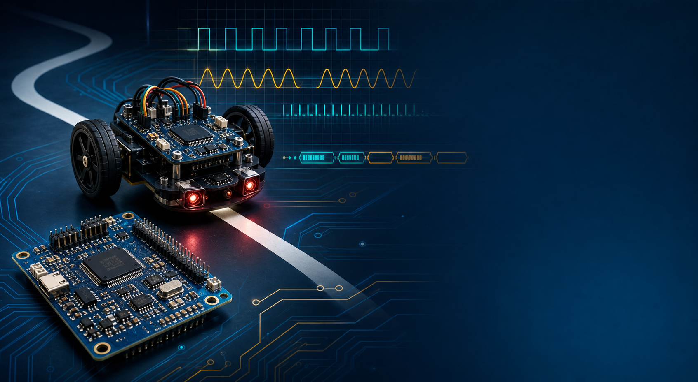

# Embedded Contest Kit

[Chinese Version](README.zh-CN.md)

[](https://github.com/kong336/embedded-contest-kit/actions/workflows/portable-build.yml)
[](https://github.com/kong336/embedded-contest-kit/releases)
[](LICENSE)



A competition-oriented embedded firmware starter pack focused on reusable C modules, STM32 HAL adapters, and copy-ready examples.

This repository is meant for the very common situation of:

- "I need a clean speed loop base first."
- "I need button plus menu code that is not a mess."
- "I need line-following, UART packet, buzzer, servo, and timing helpers I can reuse quickly."

## What is inside

- `generic_c/`: portable C modules for control, filtering, scheduling, state flow, packets, and utility logic
- `stm32_hal/`: STM32 HAL-facing wrappers for ADC, PWM motors, UART packets, buttons, buzzer, servo, and encoder timers
- `examples/`: small portable examples that show how modules fit together
- `docs/`: principle notes, STM32 usage notes, and project recipe suggestions
- `tools/`: Windows helper scripts for compiler setup and portable-build verification

## Included module groups

### Control and filtering

- `contest_pid`
- `contest_incremental_pi`
- `contest_moving_average`
- `contest_low_pass`
- `contest_complementary_angle`
- `contest_value_tuner`
- `contest_ramp`

### Sensors and motion

- `contest_diff_drive`
- `contest_encoder`
- `contest_line_sensor`
- `contest_servo_map`
- `contest_ultrasonic`

### UI and application flow

- `contest_button`
- `contest_debounce`
- `contest_buzzer_pattern`
- `contest_led_pattern`
- `contest_menu`
- `contest_state_machine`
- `contest_periodic_task`
- `contest_soft_timer`

### Communication and buffering

- `contest_command_table`
- `contest_ring_buffer`
- `contest_packet`
- `contest_crc16`

### STM32 HAL adapters

- `contest_hal_adc_scan`
- `contest_hal_motor`
- `contest_hal_uart_packet`
- `contest_hal_button`
- `contest_hal_encoder_timer`
- `contest_hal_buzzer`
- `contest_hal_diff_drive`
- `contest_hal_servo`
- `contest_hal_status_led`

## Good first copy sets

- Line-following car: `contest_line_sensor`, `contest_pid`, `contest_ramp`, `contest_hal_adc_scan`, `contest_hal_motor`
- Encoder speed loop: `contest_encoder`, `contest_low_pass`, `contest_incremental_pi`, `contest_hal_encoder_timer`, `contest_hal_motor`
- Button menu: `contest_button`, `contest_state_machine`, `contest_hal_button`, `contest_hal_buzzer`
- Servo scan: `contest_servo_map`, `contest_ramp`, `contest_hal_servo`
- UART command channel: `contest_ring_buffer`, `contest_packet`, `contest_crc16`, `contest_hal_uart_packet`
- OLED menu: `contest_menu`, `contest_button`, `contest_hal_button`
- Differential-drive car: `contest_diff_drive`, `contest_hal_diff_drive`, `contest_hal_motor`
- Ultrasonic obstacle ranging: `contest_ultrasonic`, `contest_low_pass`
- Balance car starter: `contest_complementary_angle`, `contest_pid`, `contest_incremental_pi`, `contest_periodic_task`
- Parameter tuning page: `contest_menu`, `contest_value_tuner`, `contest_hal_button`
- Status LED feedback: `contest_led_pattern`, `contest_hal_status_led`

More recipe-style module bundles are listed in [docs/project_recipes.md](docs/project_recipes.md).

## Quick start

1. Generate your base project in STM32CubeMX if you are using STM32.
2. Copy only the modules you need.
3. Keep reusable logic in `generic_c/`.
4. Keep board binding in `stm32_hal/`.
5. Use `examples/` as structure references, not as drop-in final firmware.

## Local verification

On Windows, you can verify all portable modules and examples with:

```powershell
powershell -ExecutionPolicy Bypass -File .\tools\verify_portable_build.ps1 -Compiler clang
powershell -ExecutionPolicy Bypass -File .\tools\verify_portable_build.ps1 -Compiler gcc
powershell -ExecutionPolicy Bypass -File .\tools\verify_portable_build.ps1 -Compiler cl
```

Toolchain notes are in [docs/compiler_notes.md](docs/compiler_notes.md).

## Recommended reading

- [docs/module_principles.md](docs/module_principles.md)
- [docs/project_recipes.md](docs/project_recipes.md)
- [docs/stm32_hal_usage.md](docs/stm32_hal_usage.md)
- [docs/bringup_checklist.md](docs/bringup_checklist.md)
- [docs/tuning_playbook.md](docs/tuning_playbook.md)

## Notes for GitHub display

- This repository is designed to be a reusable toolkit, not one locked board project.
- The STM32 HAL examples intentionally stop at the reusable boundary and leave CubeMX init, specific OLED drivers, and IMU register drivers to the board project.

## Intentionally not included

- board-specific CubeMX generated initialization
- OLED font tables
- MPU6050 or other IMU register drivers
- DMA or interrupt startup files for every board
- one giant board-locked demo project

Those parts change a lot between boards. The goal here is to keep the reusable layer clean and portable.
